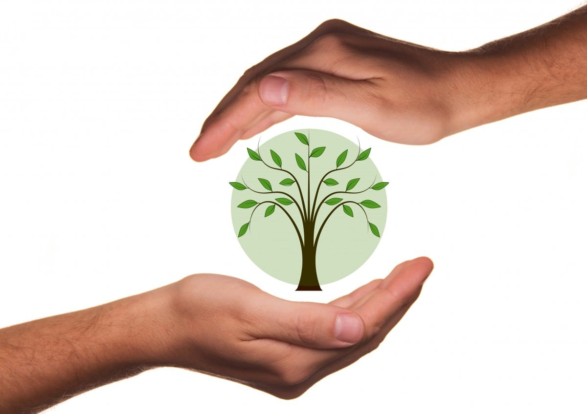
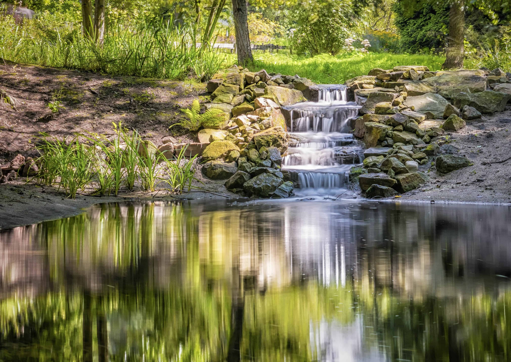
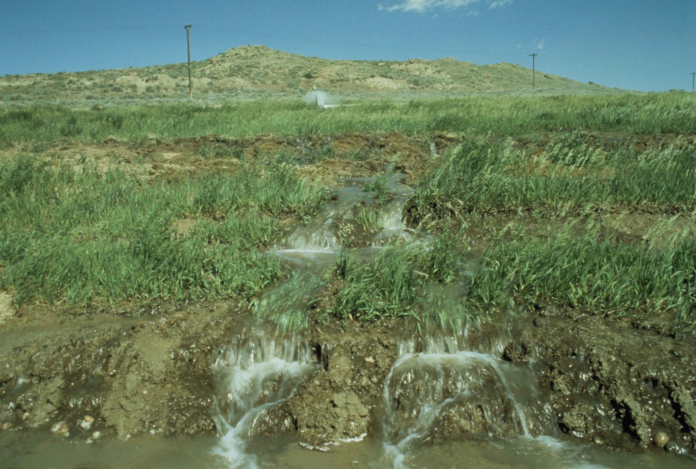
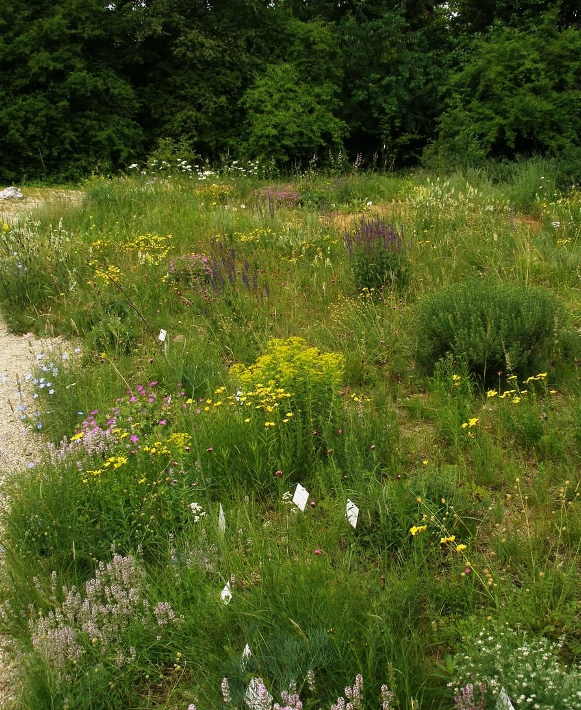

# Permakultur Ethik

Die Ethik der Permakultur bildet das Rückgrat des gesamten Konzepts. Sie besteht aus «Earth Care» (für die Erde sorgen), «People Care» (Für die Menschen Sorgen) und «Fair Share» (gerechtes Teilen). Auf der Ethik baut sich das Arbeiten und die Philosophie der Permakultur-Prinzipien auf. Sie dient und hilft bei der Orientierung und Herangehensweise bei Problemen und Herausforderungen, welche sich durch die Eigenschaften der Natur und der Menschen ergeben. Darüber hinaus hilf die Ethik (wenn eingehalten) beim Gestallten von dauerhaften, nachhaltigen und produktiven Projekten und Konzepten.
Trotz der wegweisenden Funktion der Ethik, ist für mich wichtig, dass man diese nicht als dogmatisch betrachtet. Sie bieten jedem Anwender gewisse Freiheiten, welche fundamental wichtig sind, um ein Projekt auf sich, seine Umwelt und den vor Ort anzutreffenden gesellschaftlichen Begebenheiten anzupassen.

## «Earth care»

«Earth Care» ist die Ethik die konsequent betrachtet über das Individuelle und Persönliche hinausgeht. Wenn nicht mehr die persönliche Bereicherung im Vordergrund steht, sondern der Wunsch dem grossen Ganzen (allen Menschen, der Biodiversität, der Bodenqualität, …) einen Beitrag zu leisten, kann man von «Earth Care» reden. Wenn es dem Planeten gut geht, haben wir die besten Voraussetzungen damit es uns auch gut geht.

Schütze unsere Erde, Trage sorge zu unserer Erde, Kümmere dich um die Erden. Diese Grundethik wird als die grundlegendste und wichtigste der drei Ethiken betrachtet. Denn ohne Erde, auch keine Menschen! So simpel, einfach und traurig es ist, scheint es für viele Menschen noch nicht klar zu sein, dass wenn wir unseren Planeten zugrunde richten, uns auch gleich mit zerstören. Aus meiner Sicht ist es nicht erstrebenswert nach einem neuen Planeten zu suchen, welche man evtl. besiedeln und zusätzlich ausbeuten könnten, während wir unsere Heimat zerstören.

Also «Earth Care» widmet sich einerseits dem Schutz unserer noch bestehenden natürlichen Lebensräume, wie auch dem Aufbau neuer lebensfreundlicher Strukturen und Systeme für Mensch, Tier und Natur.

Es gilt unsere noch vorhanden Ressourcenvorkommen zu schützen, wie sauberes Trinkwasser und gesunde Böden aber auch die Fauna und Flora der jeweiligen Gebiete und Klimazonen. Denn mit dieser Ethik wird uns auch bewusst, dass die Komplexität der noch natürlichen bestehenden Ökosysteme eine Bedingung für die Stabilität des ganzen Kreislaufs ist. Werden einzelne Arten ausgelöscht, kann der Rest des Systems ins Schwanken geraten und eine zerstörerische Abwärtsspirale nimmt Fahrt auf.

Auf einige wichtige Beispiele angewendet könnte man es so formulieren:

## Wasser

Wasser bedeutet Leben. Ohne Wasser auch kein Leben. Also schützen wir unsere vorhandenen Quellen, Seen, Flüsse und Teiche. Wenn wir Wasser in unserem System aufnehmen, sollte es mit der gleichen oder sogar besseren Qualität unser Land wieder verlassen, als es zu uns gekommen ist.

## Erde

Die Erde bietet uns die Lebensgrundlage durch die Pflanzen, die sie nährt und gibt vielen anderen Lebewesen ein Zuhause.

Diese Erde treten wir leider nach wie vor mit Füssen. Durch unachtsamen und unbewussten Umgang mit ihr, verliert sie ihre natürliche Fruchtbarkeit, verarmt und die Lebewesen, die sie am Leben erhalten gehen zugrunde. Daraus erfolgen Missernten, Überschwemmungen, weiterer Bodenverlust und die allgemeine Qualität der Ernten nimmt ab. Darauf mit mehr Chemie, Kunstdünger und genmanipulierten Kulturen zu antworten ist weitsichtig Betrachtet der falsche Weg. Wenn wir unsere Böden pflegen und eine aufbauende Bewirtschaftung praktizieren, können wir nur Vorteile daraus gewinnen. Die natürliche Resistenz der Pflanzen wird gestärkt, die Qualität wird zunehmen, die Böden können wieder mehr Wasser speichern, Überschwemmungen und Erosion werden verhindert. Des Weiteren kann der Humusaufbau CO2 aus der Atmosphäre speichern und dadurch aktuelle Probleme begrenzt werden.

## Biodiversität

Die Biodiversität ist ein ebenso wichtiger Bestandteil des gesamten Systems. Die einzelnen Arten sind von anderen abhängig und mit dem Verschwinden der einen Art, kann das Überleben der anderen gefährdet oder sogar verunmöglicht werden.

Wenn einzelne Arten ausgerottet werden, kann das im ersten Moment noch als unwichtig erscheinen, auf lange Sicht hinaus, kann es aber weitreichende Folgen haben. Wenn zum Beispiel der natürliche Gegenspieler einer Art fehlt, kann sich diese ungestört vermehren und zum Problemfall für das Ökosystem werden oder bestehende Symbiosen werden zerstört.

Es ist immer heikel, wenn aus einem komplexen Kreislauf einzelne Teile wegbrechen. Man könnte es sich auch wie ein Getriebe oder ein Uhrwerk vorstellen. Wenn Zahnräder fehlen, gerät die ganze Maschine ins Stocken.

Auch wenn wir nur einen kleinen Garten oder einen Balkon haben, können wir einen Teil zum Wohlergehen unserer Natur beitragen.

